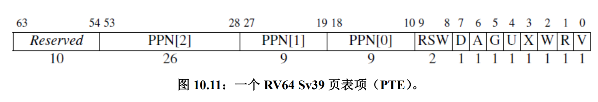

- 参考博客：[Xiao Fan](https://fanxiao.tech/posts/2021-03-02-mit-6s081-notes/#85-lab-6-copy-on-write-fork)
- [RISC-V手册](http://staff.ustc.edu.cn/~llxx/cod/reference_books/RISC-V-Reader-Chinese-v2p12017.pdf)


# 1 Copy-on-Write Fork 介绍

**基本流程**
1. 初始状态（`fork()` 刚完成）
    - 父进程与子进程共享所有的物理页，但它们的 PTE 标记为只读（`PTE_W=0`）
    - 任何写入尝试都会触发存储页错误
2. 写入触发存储页错误（trap handler 介入）
    - 检查该页的引用计数：
        - 如果**仅当前进程引用该页**（无其他共享者），则直接恢复 `PTE_W` 标志，允许写入，无需复制
        - 如果**多个进程共享该页**，则：
            - 分配一个新物理页
            - 复制原页内容到新页
            - 修改当前进程的 PTE，使其指向新页，并设置 `PTE_W=1`
    - 恢复执行：重新执行触发页错误的执行，此时写入会成功


**关键机制**

1. 页引用计数
    - 每个物理页维护一个**引用计数**，记录有多少进程的 PTE 指向它
    - `fork()` 时，所有共享页的引用计数`+1`
    - COW 复制后：
        - 原页的引用计数`-1`
        - 新页的引用计数`=1`（**仅当前进程使用**）
    - 释放内存时：只有当引用计数 `=0` 时，才真正释放物理页
2. 存储页错误的优化
    - 如果仅当前进程引用该页（引用计数`=1`），则无需复制，直接恢复 `PTE_W=1` 即可
        - 例如：父进程 `fork()` 后，子进程 `exec()` 丢弃了大部分内存，此时父进程写入自己的内存时可能无需复制


# 2 uvmcopy ()

在 kernel/vm.c 的 `uvmcopy()`函数中，需要进行以下修改：
- 将父进程的物理页映射到子进程，而不是分配新页面；
- 清除父进程和子进程的 `PTE_W` 位
- 设置新添加的 `PTE_COW`位

其中，在 PTE 的 RSW 处可以设置为我们的 `PTE_COW` 位，以表明该物理页是COW Fork机制。



在 riscv.h 中添加 `PTE_COW` 位：
```c
#define PTE_COW   (1L << 8)
```


修改 `uvmcopy()`函数：

```c
int
uvmcopy(pagetable_t old, pagetable_t new, uint64 sz)
{
  pte_t *pte;
  uint64 pa, i;

  for(i = 0; i < sz; i += PGSIZE){
    if((pte = walk(old, i, 0)) == 0)
      panic("uvmcopy: pte should exist");
    if((*pte & PTE_V) == 0)
      panic("uvmcopy: page not present");

    pa = PTE2PA(*pte);
    *pte = (*pte & ~PTE_W) | PTE_COW; // 设置父页flags
    if(mappages(new, i, PGSIZE, (uint64)pa, PTE_FLAGS(*pte)) != 0){ // 设置映射和子页flags
      goto err;
    }
    refcnt_add(pa); // 增加引用计数
  }
  return 0;

 err:
  uvmunmap(new, 0, i / PGSIZE, 1);
  return -1;
}
```


# 3 usertrap ()

接下来在 kernel/trap.c 的 `usertrap()` 函数中添加对存储页错误的处理：
```c
} else if (r_scause() == 15) { // 存储页错误
    uint64 va = r_stval();
    
    if (va >= MAXVA || (va <= PGROUNDDOWN(p->trapframe->sp) && va >= PGROUNDDOWN(p->trapframe->sp) - PGSIZE))
      p->killed = 1;
    else if (refcnt_new(va, p->pagetable) == -1) // 空闲内存不足，终止进程
      p->killed = 1;
  }
```

注意这里需要检查虚拟地址是否越界，或者处于 guard page 当中，否则 usertests 无法通过。


# 4 kalloc. c

按照 COW 的逻辑，我们需要维护每一个物理页的引用计数 `refcnt`。

在 kalloc. c 中声明数据结构和辅助函数：
```c
struct {
  struct spinlock lock;
  uint cnt[(PHYSTOP - KERNBASE) / PGSIZE]; // 引用计数数组
} refcnt;

#define PA2IDX(pa) (((uint64)pa - KERNBASE) / PGSIZE) // 索引计算逻辑

// add cnt
void refcnt_add(uint64 pa) {
  acquire(&refcnt.lock);
  refcnt.cnt[PA2IDX(pa)]++;
  release(&refcnt.lock);
}

// set cnt
void refcnt_setter(uint64 pa, uint n) {
  refcnt.cnt[PA2IDX(pa)] = n;
}

// get cnt
uint refcnt_getter(uint64 pa) {
  return refcnt.cnt[PA2IDX(pa)];
}

// kalloc() without lock
void *
kalloc_nolock(void)
{
  struct run *r;

  acquire(&kmem.lock);
  r = kmem.freelist;
  if(r)
    kmem.freelist = r->next;
  release(&kmem.lock);

  if(r)
    memset((char*)r, 5, PGSIZE); // fill with junk
  
  if (r)
    refcnt.cnt[PA2IDX((uint64)r)]++;
  return (void*)r;
}

// create new physical page
int refcnt_new(uint64 va, pagetable_t pagetable) {
  pte_t *pte;
  uint64 pa;
  uint flags, cnt;

  va = PGROUNDDOWN(va);
  pte = walk(pagetable, va, 0);
  pa = PTE2PA(*pte);
  flags = PTE_FLAGS(*pte);

  if (!(flags & PTE_COW)) // 非COW页，不予处理
    return -2;

  acquire(&refcnt.lock);
  cnt = refcnt_getter(pa);
  if (cnt > 1) { // 多页则需要创建新页
    char *mem = kalloc_nolock();
    if (mem == 0) // 空闲内存不足
      goto bad;
    memmove(mem, (char *)pa, PGSIZE); // 复制旧页到新页
    uvmunmap(pagetable, va, 1, 0); // 需要旧页原有的映射
    if (mappages(pagetable, va, PGSIZE, (uint64)mem, (flags & ~PTE_COW) | PTE_W) != 0) { // 设置新映射
      kfree(mem);
      goto bad;
    }
    refcnt_setter(pa, cnt - 1); // 旧页引用计数-1
  } else { // 单页直接写入
    *pte = (*pte & ~PTE_COW) | PTE_W;
  }
  release(&refcnt.lock);
  return 0;

  bad:
    release(&refcnt.lock);
    return -1;
}
```
- `refcnt_new()` 中只能使用 `kalloc_nolock()`，因为其已经声明 `acquire(&refcnt.lock)`，如果直接使用 `kalloc()`，里面会再一次声明，便会触发 `panic("acquire")`


`kinit()` 中初始化 `refcnt`：

```c
void
kinit()
{
  initlock(&kmem.lock, "kmem");
  initlock(&refcnt.lock, "refcnt");
  memset(refcnt.cnt, 0, sizeof(refcnt.cnt)); // 数组初始化为0
  freerange(end, (void*)PHYSTOP);
}
```


在 `kalloc()` 初始化引用计数：

```c
void *kalloc(void)
{
  struct run *r;

  acquire(&kmem.lock);
  r = kmem.freelist;
  if(r) {
    kmem.freelist = r->next;
    acquire(&refcount.lock);
    refcount.count[PA2IDX((uint64) r)] = 1; // 初始设置为1
    release(&refcount.lock);
  }
  release(&kmem.lock);

  if(r)
    memset((char*)r, 5, PGSIZE); // fill with junk
  return (void*)r;
}
```


修改 `kfree()` 的逻辑，只有引用计数为 0 时才释放物理内存：

```c
void
kfree(void *pa)
{
  struct run *r;

  if(((uint64)pa % PGSIZE) != 0 || (char*)pa < end || (uint64)pa >= PHYSTOP)
    panic("kfree");

  acquire(&refcnt.lock);
  int cnt = refcnt_getter((uint64)pa);
  if (cnt > 1) { // 存在多个引用，不释放内存
    refcnt_setter((uint64)pa, cnt - 1);
    release(&refcnt.lock);
    return;
  }

  // 清零计数
  refcnt_setter((uint64)pa, 0);
  release(&refcnt.lock);

  // Fill with junk to catch dangling refs.
  memset(pa, 1, PGSIZE);

  r = (struct run*)pa;

  acquire(&kmem.lock);
  r->next = kmem.freelist;
  kmem.freelist = r;
  release(&kmem.lock);
}


```


更新 `kalloc()` 函数，使其分配内存时初始化计数：

```c
void *kalloc(void)
{
  struct run *r;

  acquire(&kmem.lock);
  r = kmem.freelist;
  if(r)
    kmem.freelist = r->next;
  release(&kmem.lock);

  if(r)
    memset((char*)r, 5, PGSIZE); // fill with junk
  
  if (r)
    refcnt_add((uint64)r);
  return (void*)r;
}
```


# 5 copyout ()

最后需要修改 `copyout()`，使其当目标页为 COW 页时，分配一个新的物理页：
```c
int copyout(pagetable_t pagetable, uint64 dstva, char *src, uint64 len)
{
  uint64 n, va0, pa0;
  pte_t *pte;

  while(len > 0){
    va0 = PGROUNDDOWN(dstva);
    pa0 = walkaddr(pagetable, va0);
    if(pa0 == 0)
      return -1;

    pte = walk(pagetable, va0, 0);
    if (*pte & PTE_COW) {
      refcnt_new(va0, pagetable);
      pa0 = PTE2PA(*pte); // 需要更新pa0，否则还是写入原页
    }

    n = PGSIZE - (dstva - va0);
    if(n > len)
      n = len;
    memmove((void *)(pa0 + (dstva - va0)), src, n);

    len -= n;
    src += n;
    dstva = va0 + PGSIZE;
  }
  return 0;
}
```


