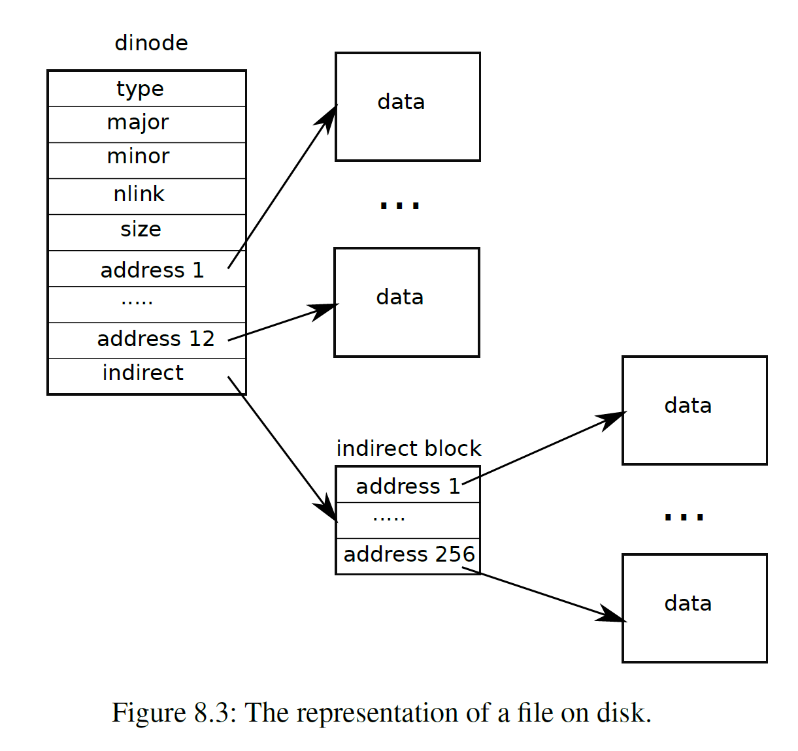

## Large files

实验目的：
- 扩充 inode 的 `addrs` 数组，为其减少一个直接块，增加一个二级间接块，其存储一级间接块的地址
- 修改 `bmap()`，使得其能定位二级间接块里的数据块
- 修改 `itrunc()`，使其能释放二级间接块及其中的所有块


`addrs` 数组的结构：



首先修改全局变量以及 `struct inode/dinode`：

```c
#define NDIRECT 11
#define NINDIRECT (BSIZE / sizeof(uint))
#define MAXFILE (NDIRECT + NINDIRECT + NINDIRECT * NINDIRECT)

// On-disk inode structure
struct dinode {
	short type; // File type
	short major; // Major device number (T_DEVICE only)
	short minor; // Minor device number (T_DEVICE only)
	short nlink; // Number of links to inode in file system
	uint size; // Size of file (bytes)
	uint addrs[NDIRECT+2]; // Data block addresses
};

// in-memory copy of an inode
struct inode {
	uint dev; // Device number
	uint inum; // Inode number
	int ref; // Reference count
	struct sleeplock lock; // protects everything below here
	int valid; // inode has been read from disk?
	  
	short type; // file or directory
	short major;
	short minor;
	short nlink;
	uint size;
	uint addrs[NDIRECT+2];
};
```


接着为 `bmap()` 增加索引二级间接块的逻辑：

```c
static uint
bmap(struct inode *ip, uint bn)
{
	uint addr, *a;
	struct buf *bp;
	  
	if(bn < NDIRECT){
		if((addr = ip->addrs[bn]) == 0)
			ip->addrs[bn] = addr = balloc(ip->dev);
		return addr;
	}
	bn -= NDIRECT;
	
	if(bn < NINDIRECT){
		// Load indirect block, allocating if necessary.
		if((addr = ip->addrs[NDIRECT]) == 0)
			ip->addrs[NDIRECT] = addr = balloc(ip->dev);
		bp = bread(ip->dev, addr);
		a = (uint*)bp->data;
		if((addr = a[bn]) == 0){
			a[bn] = addr = balloc(ip->dev);
			log_write(bp);
		}
		brelse(bp);
		return addr;
	}
	bn -= NINDIRECT;
	  
	if (bn < NINDIRECT * NINDIRECT) {
		int id = bn / NINDIRECT;
		int off = bn % NINDIRECT;
		if ((addr = ip->addrs[NDIRECT + 1]) == 0) // 先检查二级间接块是否存在
			ip->addrs[NDIRECT + 1] = addr = balloc(ip->dev);
		bp = bread(ip->dev, addr);
		a = (uint *)bp->data;
		if ((addr = a[id]) == 0) { // 检查其中的一级间接块是否存在
			a[id] = addr = balloc(ip->dev);
			log_write(bp); // 记录修改
		}
		brelse(bp); // 释放二级间接块
	  
		bp = bread(ip->dev, addr); // 读取一级间接块
		a = (uint *)bp->data;
		if ((addr = a[off]) == 0) {
			a[off] = addr = balloc(ip->dev);
			log_write(bp);
		}
		brelse(bp);
		return addr;
	}
	
	panic("bmap: out of range");
}
```


修改 `itrunc()` 的逻辑，使其能够释放二级间接块：

```c
void
itrunc(struct inode *ip)
{
	int i, j;
	struct buf *bp;
	uint *a;
	
	for(i = 0; i < NDIRECT; i++){
		if(ip->addrs[i]){
			bfree(ip->dev, ip->addrs[i]);
			ip->addrs[i] = 0;
		}
	}
	  
	if(ip->addrs[NDIRECT]){
		bp = bread(ip->dev, ip->addrs[NDIRECT]);
		a = (uint*)bp->data;
		for(j = 0; j < NINDIRECT; j++){
			if(a[j])
				bfree(ip->dev, a[j]);
		}
		brelse(bp);
		bfree(ip->dev, ip->addrs[NDIRECT]);
		ip->addrs[NDIRECT] = 0;
	}
	
	// 释放二级间接块
	if (ip->addrs[NDIRECT + 1]) {
		bp = bread(ip->dev, ip->addrs[NDIRECT + 1]);
		a = (uint *)bp->data;
		
		struct buf *bps;
		uint *b;
		for (j = 0; j < NDIRECT; ++j) {
			if (a[j]) { // 一级间接块存在，则需要先释放其中的数据块
				bps = bread(ip->dev, a[j]);
				b = (uint *)bps->data;
				for (int i = 0; i < NDIRECT; ++i) {
					if (b[i])
						bfree(ip->dev, b[i]);
				}
				brelse(bps);
				bfree(ip->dev, a[j]); // 释放一级间接块
			}
		}
		brelse(bp);
		bfree(ip->dev, ip->addrs[NDIRECT + 1]);
		ip->addrs[NDIRECT + 1] = 0;
	}
	
	ip->size = 0;
	iupdate(ip);
}
```


## Symbolic links


硬链接是同一个文件的多个目录入口，指向相同的 inode；而软链接则是一个独立的文件，存储的是目标文件的路径。


实验目的：

- 添加并实现 `symlink(char *target, char *path)` 系统调用，使得为 `target` 创建 `path` 软链接
- 修改 `open()`，添加对软链接的处理


对于 `symlink()` 系统调用的添加不再赘述。


在 fcntl. h 中添加 `O_NOFOLLOW`，由于不能与已有标志重叠，所以设置为 `0x800`

```c
#define O_RDONLY 0x000
#define O_WRONLY 0x001
#define O_RDWR 0x002
#define O_CREATE 0x200
#define O_TRUNC 0x400
#define O_NOFOLLOW 0x800
```


`symlink()` 的实现：创建一个 inode，设置类型为 `T_SYMLINK`，然后向 inode 中写入 `path` 即可

```c
uint64
sys_symlink(void)
{
  char target[MAXPATH];
  memset(target, 0, sizeof(target));
  char path[MAXPATH];
  if(argstr(0, target, MAXPATH) < 0 || argstr(1, path, MAXPATH) < 0){
    return -1;
  }
  
  struct inode *ip;

  begin_op();
  if((ip = create(path, T_SYMLINK, 0, 0)) == 0){
    end_op();
    return -1;
  }

  if(writei(ip, 0, (uint64)target, 0, MAXPATH) != MAXPATH){
    // panic("symlink write failed");
    return -1;
  }

  iunlockput(ip);
  end_op();
  return 0;
}
```


在 `sys_open` 中添加对符号链接的处理：

```c
uint64
sys_open(void)
{
  ...
	if(ip->type == T_DEVICE && (ip->major < 0 || ip->major >= NDEV)){
		...
	}

  if(ip->type == T_SYMLINK){
    if(!(omode & O_NOFOLLOW)){ // 检查是否要求不解析链接
      int cycle = 0;
      char target[MAXPATH];
      while(ip->type == T_SYMLINK){
        if(cycle == 10){ // 最大递归深度10
          iunlockput(ip);
          end_op();
          return -1; // max cycle
        }
        cycle++;
        // 读取目标路径
        memset(target, 0, sizeof(target));
        readi(ip, 0, (uint64)target, 0, MAXPATH);
        iunlockput(ip);
        // 根据目标路径获取新的inode
        if((ip = namei(target)) == 0){
          end_op();
          return -1; // target not exist
        }
        ilock(ip);
      }
    }
  }

  if((f = filealloc()) == 0 || (fd = fdalloc(f)) < 0){
		...
	}
	...
}
```
- 文件路径指向一个软链接时，系统需要递归地解析链接目标，直到找到最终的非链接文件或达到最大递归深度